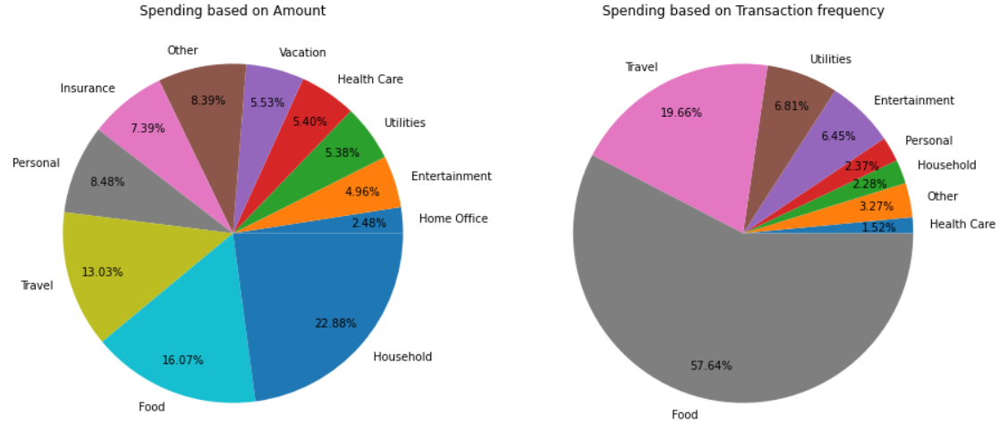

# exp-tracker
This is for my expenses analysis project where I look at my expense data for meaningful insights.

### Expense_Analysis.ipynb

This notebook has the analysis of my spending. The data for this notebook is made from my personal expenses using Expense Manager app. I recorded almost all my expense transactions to manage my finances and also for this project. I used the entire data for analysis but since the data has personal information about my finances, I am reducing the no of observations to 500 in the csv file uploaded here.

### Motivation

I made this notebook to get a better understanding of python for Data Science. I was auditing the course "Introduction to Data Science in Python" and I wanted to test the skills that I learnt in the course. Since I was already tracking my expenses, I started this project with learning as the main goal. 

### Dataset

The dataset **expense_tracker.csv** has 500 entries and 17 columns. The uploaded file is the smaller version of the original file since the data is personal. 
This file has data recorded for almost all my expenses for the period 2017 to 2020. There are a total of 500 entries and 17 columns.

**Column Information**

* Date: The date when the expense/income occured.
* Amount: The amount of the transaction. Income is '+' and Expense is '-'.
* Category: The transaction is categorized into 17 categories based on the nature of the transaction.
* Subcategory: The transaction is categorized into 49 subcategories based on the nature of the transaction.
* Payment method: The type of payment used to complete the transaction
* Description: Description of the transaction, if any
* Ref/Check no: Not used
* Status: Cleared/Uncleared, this is for credit card transactions I did not use this.
* Receipt Nature: Not Used.
* Account: "Personal Expense" is the type used for all.
* Tag: Tags used (most NaN) -> Vacation, Sports, Masters, Loans
* Tax: Not Used
* Quantity: By default, 1 PCS but Not Used.
* Split Total: Not Used.
* Row Id: Not Used. This Id is created automatically by the app.

* Type Id: Not Used.

### Insights
#### Expense trend

This plot shows the expense amount and no of transactions for the period 2017 and 2020.

#### Expense vs Month

This plot shows the monthly expenses from 2017 to 2020. The monthly expenses was the highest during October while it was lowest during May. The no of transactions is also shown (blue line) - highest in January and lowest in April

#### Payment Methods

This pie chart shows my preferred payment methods. Credit cards followed by digital wallets are my favourite payment methods. Cash payment is used for less than 13% of the transactions.

#### Spending Trends

This plot shows the spending trends based on the amount and no of transactions.
